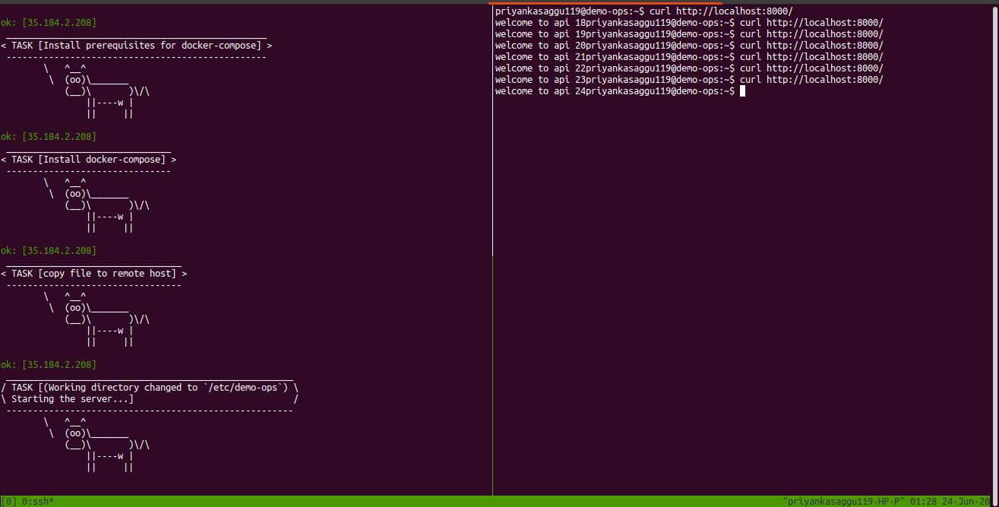

# [SOLVED] Zerodha Ops Task 

*[**NOTE**] Public Docker Image (hosted at Docker Hub): [priyankasaggu119/go-redis-task:1.0.0](https://hub.docker.com/layers/priyankasaggu119/go-redis-task/1.0.0/images/sha256-2a8bf9d4a4b037dc579371368fa91bc4476f1979746984050eac76cb491d7953?context=repo)*

## Description

This is a sample `Go` application which connects to Redis. The app increments a `counter` on an incoming request.

### Setting up the app

- Use `make build` to compile the binary.
- Set the environment variables:
    - `DEMO_APP_ADDR`: Address where the app should listen to
    - `DEMO_REDIS_ADDR`: Address where Redis is running

## Tasks

- [X] Create a `Dockerfile` for the app. [**[SOLUTION](https://github.com/Priyankasaggu11929/zerodha-task/blob/master/application/Dockerfile)**]

- [X] Create a `docker-compose.yml` for the app which includes [**[SOLUTION](https://github.com/Priyankasaggu11929/zerodha-task/blob/master/application/docker-compose.yml)**]

  - [X] `redis` service, with the data directory of `redis` mounted at `/data` in your VM.
  - [X] `app` service running with port `8000` exposed to the host.
  
- [X] Write a bash script that creates and boots [Vagrant box](https://vagrant.io) with Ubuntu. [**[SOLUTION](https://github.com/Priyankasaggu11929/zerodha-task/blob/master/vagrant_boot.sh)**]

- Using Ansible provision the VM to: [**[SOLUTION](https://github.com/Priyankasaggu11929/zerodha-task/blob/master/playbooks/main.yml)**]

  - [X] Setup hostname of VM as `demo-ops`
  - [X] Create a user `demo`
  - [X] Configure `sysctl` for sane defaults. For eg: increasing open files limit. Configure a variety of `sysctl` settings to make the VM a production grade one.
  - [X] Set the system's timezone to "Asia/Kolkata"
  - [X] Install Docker and Docker-Compose
  - [ ] Configure Docker Daemon to have sane defaults. For eg: to keep logs size in check.
  - [X] Deploy the `docker-compose.yml` in `/etc/demo-ops` and start the services

- [X] Commit the scripts to Github and share the link.

#### Commands to run the ansible playbook

- Run the following command to provision the VM for the above checkpoints.

```bash
$ ansible-playbook playbooks/main.yml 
```
- Run the following to clean up the docker-compose run.

```bash
$ ansible-playbook playbooks/clean.yml 
```

---

### Bonus Section

If you have experience working with Kubernetes, you can attempt the bonus scenario: [**[SOLUTION](https://github.com/Priyankasaggu11929/zerodha-task/tree/master/kubernetes-deployment)**]

- [X] Create a namespace `demo-ops`
- [X] Create a deployment and service manifest for the app.
- [X] Configure liveliness check, resource quotas for the deployment.


