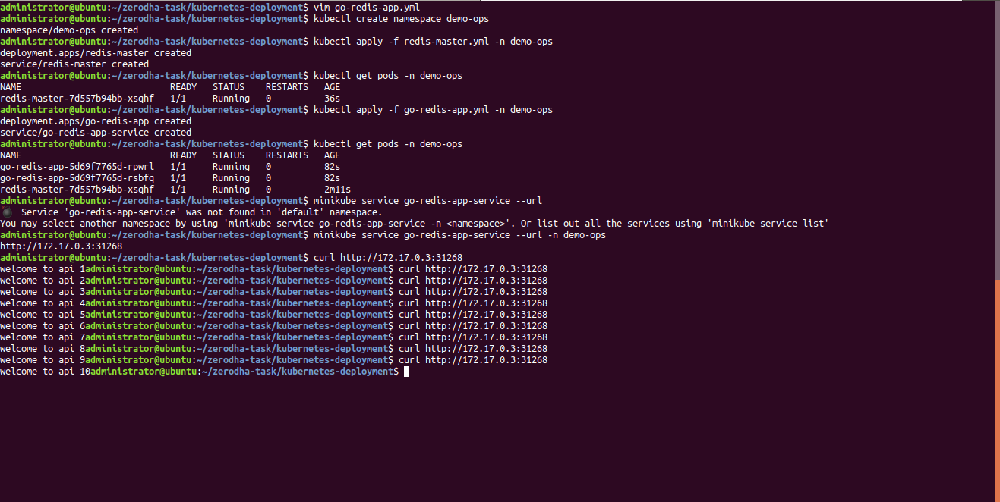

### STEPS TO DEPLOY THE GO/REDIS INCREMENT COUNTER APPLICATION

---

*[NOTE: I'm considering here a minikube single node cluster setup!]*

*[Go Application public docker image: [priyankasaggu119/go-redis-task:1.0.0](https://hub.docker.com/layers/priyankasaggu119/go-redis-task/1.0.0/images/sha256-2a8bf9d4a4b037dc579371368fa91bc4476f1979746984050eac76cb491d7953?context=repo)]*

- **STEP 1:** Create a namespace `demo-ops`.

```
$ kubectl create namespace demo-ops
```  

- **STEP 2:** Deploy Redis (both the kubernetes deployment & service manifest) and check whether the pods are ready & running.

```
$ kubectl apply -f redis-master.yml -n demo-ops

$ kubectl get pods -n demo-ops
```

- **STEP 3:** Once the Redis pods are up & running, then deploy the Go application. Once again check whether all the pods are ready.

```
$ kubectl apply -f go-redis-app.yml -n demo-ops

$ kubectl get pods -n demo-ops
```

- **STEP 4:** Run the following command to access the go application (exposed via the service). It will output a url.

```
$ minikube service go-redis-app-service --url -n demp-ops
```

- **STEP 5:** Hit the endpoint/url (received in the last step).

```
curl <url>
```


